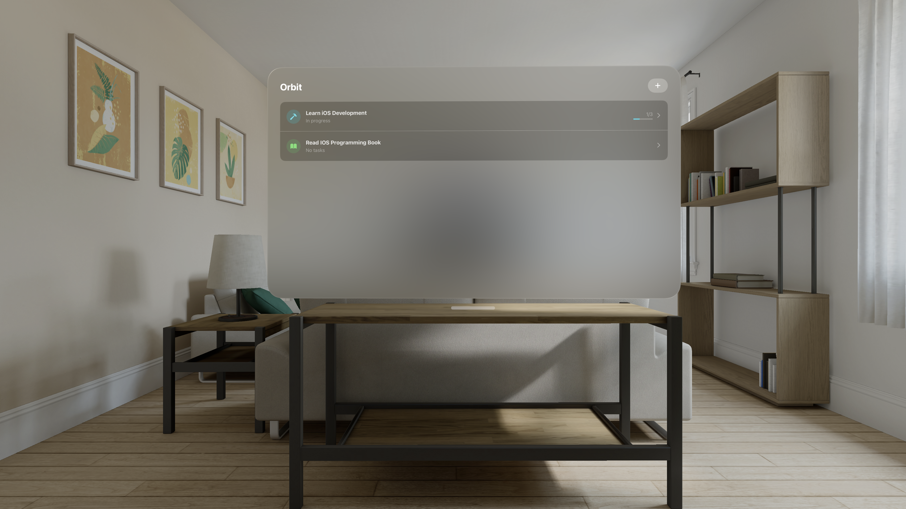
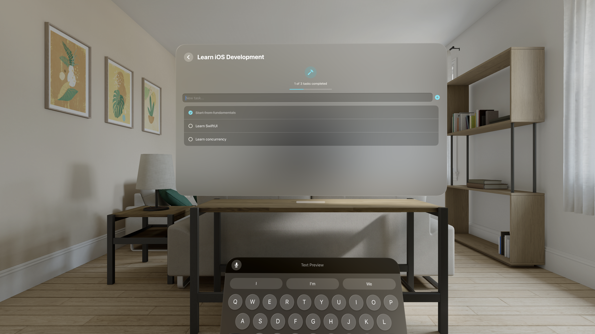

# Orbit

A project and task management app built for Apple Vision Pro using SwiftUI, SwiftData, and RealityKit.

Orbit lets you create projects, organize tasks within them, and track your progress — all in a spatial interface designed for visionOS.

## Features

- **Project management** — Create, edit, and delete projects with custom SF Symbol icons and colors
- **Task tracking** — Add tasks, mark them complete with a tap, swipe to delete
- **Live progress** — Progress bars and completion stats update in real time
- **Persistent storage** — All data saved locally with SwiftData
- **10 color themes** — Purple, pink, red, orange, yellow, green, mint, teal, blue, indigo
- **12 icon options** — Curated SF Symbols for quick project identification

## Screenshots

  
  

## Requirements

- Xcode 16+
- visionOS 2.0+
- macOS 15+

## Getting Started

1. Clone the repository
   ```
   git clone https://github.com/SevarJ/Orbit
   ```
2. Open `Orbit.xcodeproj` in Xcode
3. Select the visionOS simulator as the run destination
4. Build and run (Cmd + R)

## Architecture

The app follows **MVVM** with SwiftData for persistence.

```
Orbit/
├── App/
│   ├── OrbitApp.swift              # Entry point, model container setup
│   └── AppDefaults.swift           # SF Symbol and color constants
├── Model/
│   ├── Project.swift               # @Model — project with icon, color, tasks
│   └── Task.swift                  # @Model — task with title, completion, date
├── View/
│   ├── Components/
│   │   ├── ProjectIconView.swift   # Reusable icon badge (circle + SF Symbol)
│   │   ├── TaskRowView.swift       # Reusable task row (checkbox + title)
│   │   └── ProjectProgressView.swift # Reusable progress bar with label
│   └── Project/
│       ├── ProjectListView.swift   # Main list with add, edit, delete
│       ├── ProjectRowView.swift    # List row with icon, name, progress
│       ├── ProjectDetailView.swift # Detail with tasks, toggle, add, delete
│       └── AddProjectView.swift    # Create/edit form with icon + color pickers
└── Packages/
    └── RealityKitContent/          # 3D assets for visionOS (Reality Composer Pro)
```

## Tech Stack

- **SwiftUI** — declarative UI framework
- **SwiftData** — persistence with `@Model` and `@Query`
- **RealityKit** — 3D content rendering for visionOS
- **SF Symbols** — native icon system
- **MVVM** — clean separation of concerns
